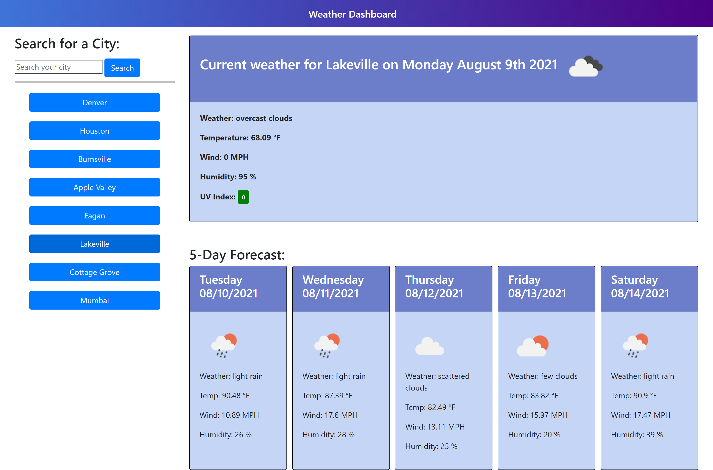

# Weather Dashboard
 &nbsp;&nbsp;&nbsp;&nbsp; &nbsp;&nbsp;&nbsp;&nbsp; &nbsp;&nbsp;&nbsp;&nbsp;

## :memo: Description
  This web application uses a third-party API to display weather information based on the city name the user provides. This app runs locally in the browser, using local storage for past city searches, featuring dynamically updated HTML and CSS.

## :trophy: Table of Contents
* [Installation](#installation)
* [Usage](#usage)
* [Contributing](#contributing)
  
  
## Installation
To run locally:
* Fork the https://github.com/Karina5151/Weather-Dashboard repo.
* Clone your forked repo to VS Code on your computer.
* Open the `index.html` file in your browswer.

  
## Usage
For the user to find weather information in any city they choose. They will be given current weather information as well as a 5 day forecast for that city. The user can also select a button on the side bar to bring up city weather searched in the past once again.

Launch the Weather Dashboard [here](https://karina5151.github.io/Weather-Dashboard/)

  
  
## Contributing
This application was developed by Karina Clausen.

The technologies that made this possible are:
* HTML
* CSS
* <a href="https://www.javascript.com/" target="_blank">JavaScript</a>
* <a href="https://getbootstrap.com/" rel="nofollow" target="_blank">Bootstrap</a>
* <a href="https://jquery.com/" rel="nofollow" target="_blank">JQuery</a>
* Local Storage
* Third-party API Usage

Acess the Weather API used to create this app [here](https://openweathermap.org/api/one-call-api)

  
 ---

## :question: Questions

For any questions, please contact me using the information below:

:octocat: GitHub: [@Karina5151](https://github.com/Karina5151)

:envelope: Email: karina.clausen.11@gmail.com

